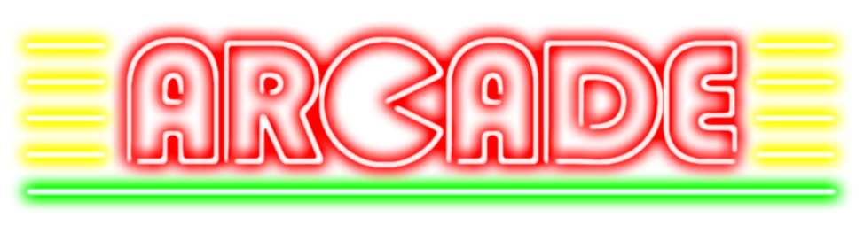

<!--[![Stargazers][stars-shield]][stars-url]-->
[![LinkedIn][linkedin-shield]][linkedin-url]


<!-- PROJECT LOGO -->
<br />
<p align="center">
  <a href="https://github.com/ugo94490/Arcade/">
    
  </a>

  <h3 align="center">Arcade</h3>
</p>


<!-- TABLE OF CONTENTS -->
## Table of Contents

* [About the Project](#about-the-project)
  * [Built With](#built-with)
* [Getting Started](#getting-started)
* [Usage](#usage)
* [Contributor](#contributor)
* [License](#license)
* [Contact](#contact)


<!-- ABOUT THE PROJECT -->
## About The Project

This project is an arcade machine of four games where you can change the graphic library and the game at runtime.

### Built With
This projet is made with three differents graphical librairies :
* [SDL 2](https://www.libsdl.org/)
* [SFML](https://www.sfml-dev.org/)
* [NCurses](https://tldp.org/HOWTO/NCURSES-Programming-HOWTO/)


<!-- GETTING STARTED -->
## Getting Started

```
$> make
$> ./arcade lib/lib_arcade_library_name.so
```

Example: ./arcade lib/lib_arcade_sfml.so


<!-- USAGE EXAMPLES -->
## Usage
```
  To launch the game do the command ./arcade lib_arcade_library_name.so

Keys :
      B to go back to menu
      R to restart the game
      P to go to previous Game
      N to go to next Game
      M to go to previous Graphical Lib
      Enter to go to next Graphical Lib
      Escape to quit
      Arrow Keys to move in each game
      In nibbler game only, press space to go faster
```


<!-- CONTRIBUTING -->
## Contributor

* [Ugo Levi--Cescutti](https://github.com/ugo94490)
* [Arthur Benard]()
* [Lucas Renard](https://github.com/LightFox7/)


<!-- LICENSE -->
## License


<!-- CONTACT -->
## Contact

Ugo Levi--Cescutti - [Linkedin](https://www.linkedin.com/in/ugo-levi-cescutti/) - ugo.levi-cescutti@epitech.eu

Project Link: [https://github.com/ugo94490/Arcade/](https://github.com/ugo94490/Arcade/)

[stars-shield]: https://img.shields.io/github/stars/ugo94490/Arcade/.svg?style=flat-square
[stars-url]: https://github.com/ugo94490/Arcade/stargazers
[linkedin-shield]: https://img.shields.io/badge/-LinkedIn-black.svg?style=flat-square&logo=linkedin&colorB=555
[linkedin-url]: https://www.linkedin.com/in/ugo-levi-cescutti/

